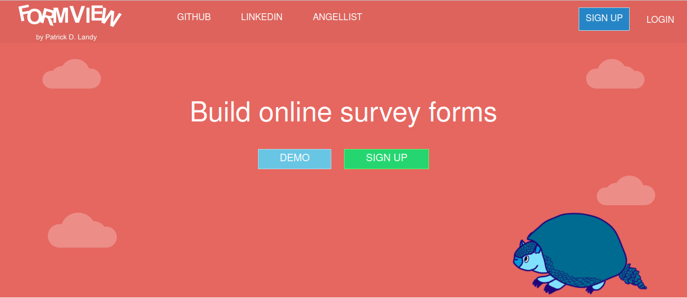
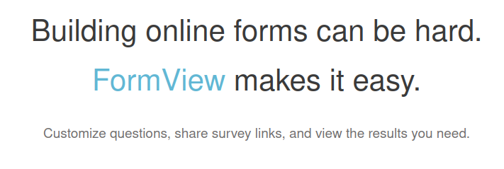
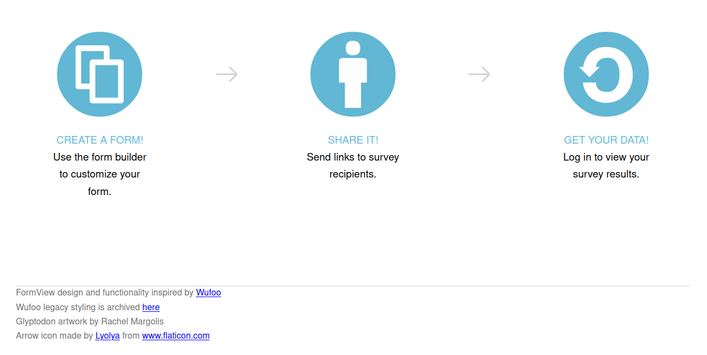
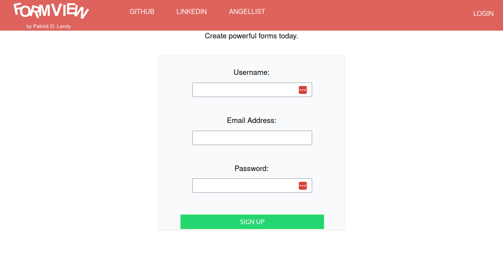
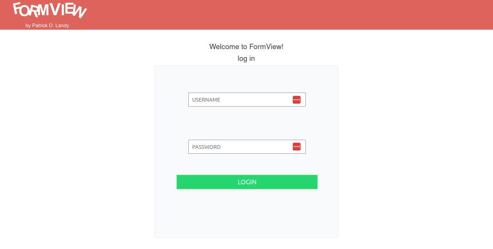
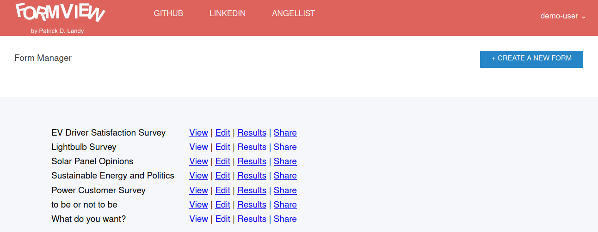
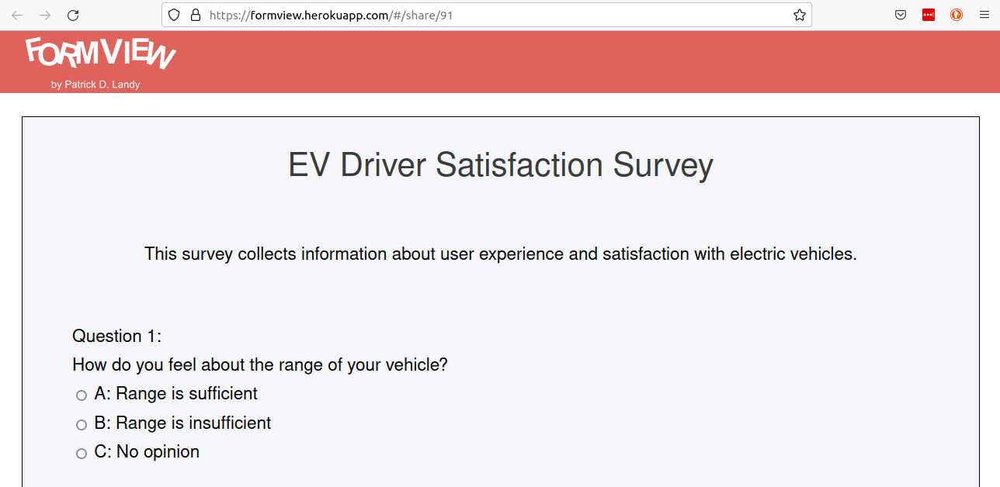
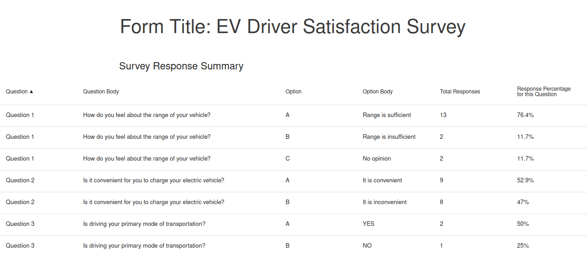
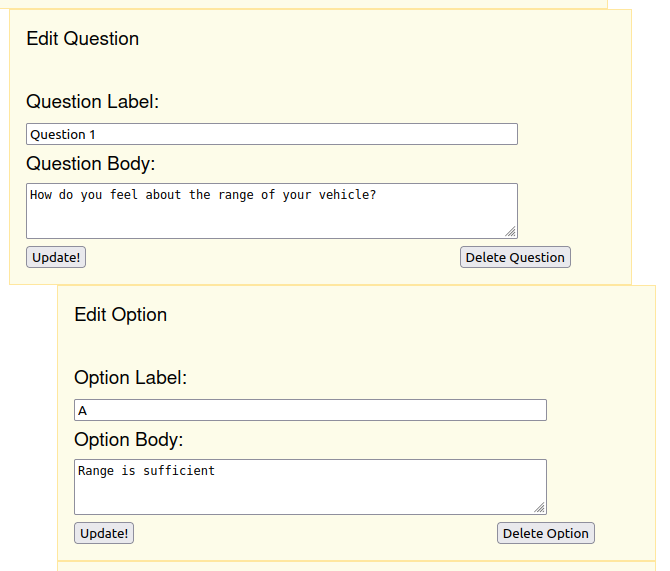

# FormView
## Full Stack Web Application
Patrick Landy

FormView is a single-page web application that uses PostgreSQL, Ruby on Rails, and React/Redux. It mimics the appearance and functionality of Wufoo by SurveyMonkey (https://www.wufoo.com/).

The application allows users to sign up, log in and log out of the site with user authentication and password digest/session management. Password digests generated using BCrypt and session tokens are stored in the database. It also demonstrates full CRUD (Create, Read, Update, Destroy) functionality for survey forms and subcomponents. The application allows users to create forms with multiple choice questions, share the forms with others, and view a data table of submissions.

FormView was deployed to a free Heroku tier from November 2019 - November 2022. It was taken down when Heroku stopped offering free hosting. Here are screenshots taken while hosted on Heroku:












Splash page glyptodon graphic credits: Rachel Margolis

 # Technologies used:

* PostgreSQL database
    * Tables for Users, Forms, Elements, and Options
* MVC (Model/View/Controller) framework for back end
    * Ruby on Rails: Active Record model layer, controllers, views, router
    * JBuilder: conversion to JSON structures from back end views
* React/Redux framework for front end
    * Single page application using store container for front-end state
        * Store, Reducers, Actions, Asynchronous action creators
        * AJAX requests to back end routes
        * Customized error reducers for specific form inputs
    * React Components 
        * Containers (mapping state and dispatch to component props)
        * HashRouter for front end routing
* CSS Styling for JSX components

# Selected Key Feature Overview:

## Splash Page (front end route: #/)

The splash page functionality depends on a currentUser prop passed to the component from the frontend state.

* Conditional rendering based on log in
    * Logged out:
        * Navigation bar with various CSS hover effects 
        * Styled links for demo login and sign up
        * Cute prehistoric creature artwork :)
        * Cloud artwork using public domain SVG (Scalable Vector Graphics)
    * Logged in:
        * Form manager page with styled link to form create page
        * Modified nav bar with username and dropdown
        * Index of current user's forms

## Form Create Page (front end route: #/new)

The form create page allows users to enter the required attributes of a new survey form and persist the form to the database. The functionality of this page depends on a form errors reducer. When a required attribute is not included by the user and the form is submitted, errors are added to the front-end state and rendered on the form create page.  

 * Rendering errors in the form create component:

```
renderErrors() {
        return (
            <ul>
                {this.props.errors.map(function (error, i) {
                    return (
                        <li className="error" key={`error-${i}`}>
                            {error}
                        </li>
                    );
                })}
            </ul>
        );
    }
```

* Errors reducer (managing the slice of state for form errors):

```

import { RECEIVE_FORM_ERRORS, CLEAR_FORM_ERRORS } from "../actions/form_actions"

const formErrorsReducer = function(state = [], action) {
    Object.freeze(state);
    switch(action.type) {
        case RECEIVE_FORM_ERRORS:
            return action.errors;
        case CLEAR_FORM_ERRORS:
            return [];
        default:
            return state;
    }
}

export default formErrorsReducer;

```

* Simple Action Creator for Form Errors

```

export const receiveFormErrors = function(errors) {
    return({
        type: RECEIVE_FORM_ERRORS,
        errors: errors
    })
}

```

* Asynchronous action creator for form creation/errors

```

export const createForm = function(form) {
    return function(dispatch) {
        return FormApiUtil.createForm(form).then(
            function (payload) {
                dispatch(receiveForm(payload));
            },
            function (err) {
                dispatch(receiveFormErrors(err.responseJSON))
            }
        );
    }
}

```


